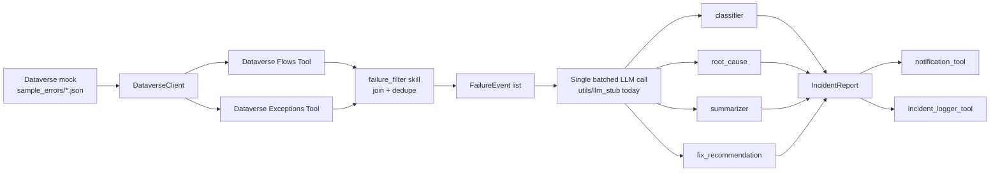

# PowerAutomateErrorAgent

An enterprise AI agent for detecting, diagnosing, and reporting failures in Power Automate Cloud Flows and Desktop (PAD) automations. Built around Azure AI Foundry Agent Service concepts such as Agent, Tools, and Skills, the project currently works in mock mode: it reads sample Dataverse-style data, joins and dedupes failures into normalized events, runs AI-assisted reasoning over each event, and produces structured incident reports that can be notified and logged.

## Architecture

The repository follows the Foundry-style pattern of an Agent orchestrating a set of Tools, where each Tool wraps a Skill. The current Phase 1 implementation is organized as follows:

- models/ — typed data contracts such as FlowRecord, ExceptionRecord, FailureEvent, and IncidentReport
- services/ — Dataverse Web API client, currently operating in mock mode
- utils/ — pure helper functions such as the OData query builder and the LLM stub
- tools/ — tool-shaped wrappers for Dataverse flows, Dataverse exceptions, notifications, and incident logging
- skills/ — pure reasoning and business-logic functions such as failure_filter, classifier, root_cause, summarizer, and fix_recommendation
- prompts/ — reusable prompt templates for the batched LLM call
- sample_errors/ — mock Dataverse fixtures for flows and exceptions
- docs/ — schema assumptions and design notes
- tests/ — fully mocked test suite with zero network calls

### Data flow



One LLM call per failure event is the intended cost-optimized shape: classification, root cause, fix recommendation, and summary are produced from a single structured prompt/response rather than five separate calls.

## Installation

```bash
python -m venv .venv
.venv\Scripts\activate        # Windows
# source .venv/bin/activate   # macOS/Linux

pip install -r requirements.txt
```

## Running tests

```bash
pytest tests/ -v
```

Current status: 106 tests passing, fully mocked, with zero network calls and zero Azure/Dataverse dependency.

## Current status

- Phase 1 — complete. Both tracks are built and tested against mock data:
  - Data & Ingestion: Dataverse client in mock mode, OData query builder, flows/exceptions tools, and failure_filter join/dedupe logic
  - Reasoning & Output: IncidentReport schema, classification/root-cause/summarization/fix-recommendation skills, LLM stub, notification tool, and incident logger
- Phase 2 — in progress. The two tracks are being wired together into a working orchestrator in app.py.
- Azure/Dataverse live access — not yet available. All Dataverse interaction today is mock-mode only, reading from sample_errors/. Live OData Web API calls, Azure AD app registration, and live schema validation against Dataverse metadata remain future work. See docs/schema_assumptions.md for the assumptions that still need to be re-verified before going live.

## Roadmap

Beyond the Phase 2 orchestrator wiring, the repository is aligned with the master prompt’s future enhancements: vector search over historical Dataverse incidents using Azure AI Search, OCR or screenshot analysis, predictive failure detection from historical exception trends, automated retry triggering back into Power Automate, a dashboard or web portal over the incidents table, REST API exposure, and multi-agent collaboration. None of these capabilities are built yet.
